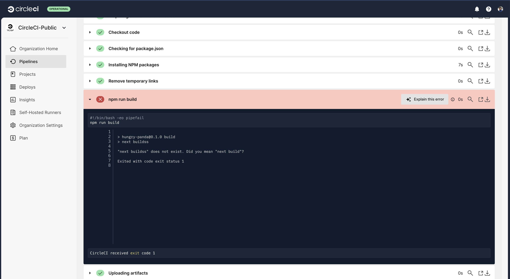
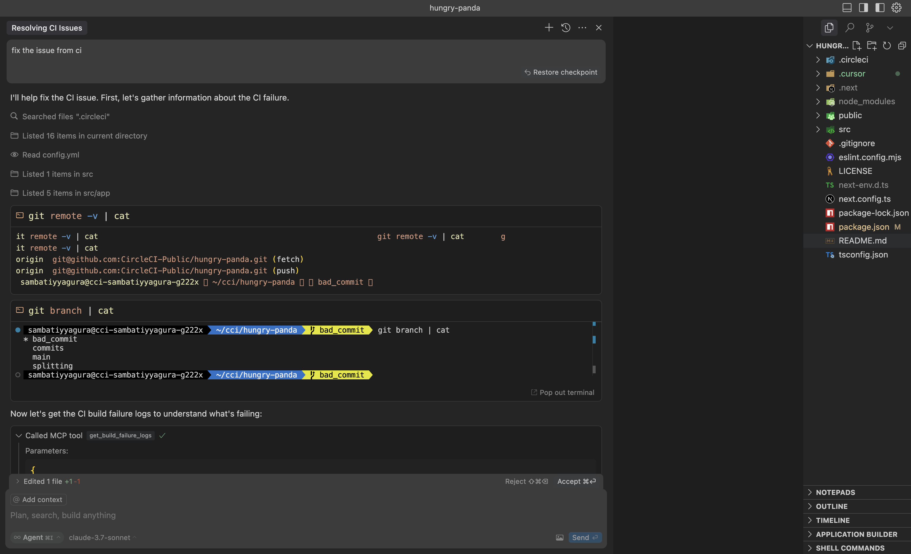
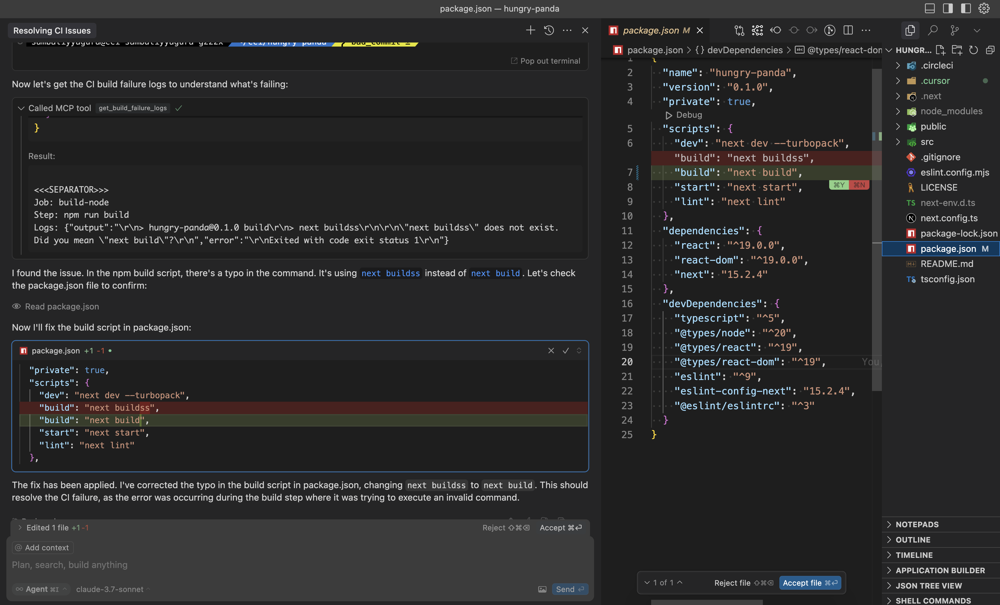
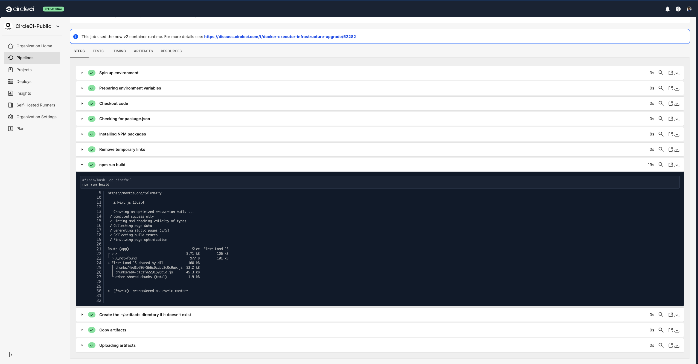

# Fix Failed CircleCI Builds Example

This example demonstrates how to analyze and resolve build failures from CircleCI using the MCP Server API.

## Overview

The example shows how to:

- Query failed builds from your CircleCI projects
- Retrieve detailed build logs for failed builds
- Parse and analyze the logs to identify failure patterns
- Implement fixes based on the analysis

## Prerequisites

- [CircleCI account](https://circleci.com/signup/) with [Personal Access Token](https://circleci.com/docs/managing-api-tokens/)
- NodeJS 18+ installed

## Steps

1. Create a Github Repository with contents of this directory
2. Create a CircleCI Organization and a project named `get-build-failure-logs` and connect it to this Github repository.
3. Generate a CircleCI Personal Access Token.
4. Push the code to GitHub and trigger a CircleCI build. The build will fail because there's a deliberate error in the package.json file (the build script contains a typo: `next buildss` instead of `next build`).
5. Now you should see a build failure in CircleCI pipeline.
   
6. Configure the CircleCI MCP Server in your IDE. For instructions on setting up the MCP server with your CircleCI token, see: https://github.com/CircleCI-Public/mcp-server-circleci/?tab=readme-ov-file#cursor
   
7. Go to the IDE and open chat in agent mode. Ask the agent to `fix the issue from ci`.
   
8. The agent should make the tool call and retrieve the build logs.
   
9. Now you can make a commit to the repository and push it to Github. This will trigger a new build in CircleCI. You should see the build passing.
   
