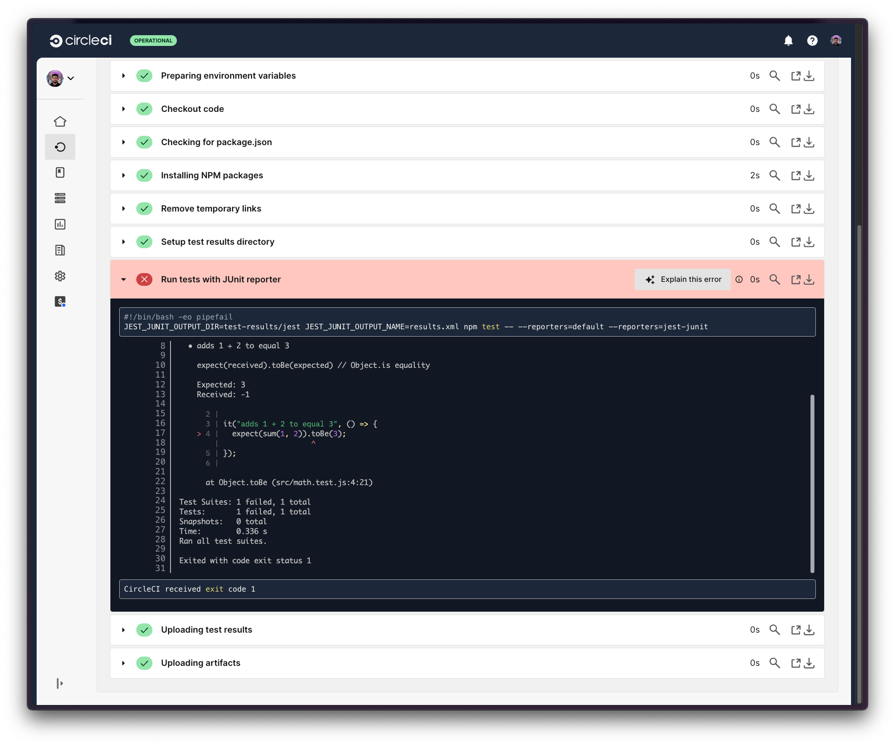
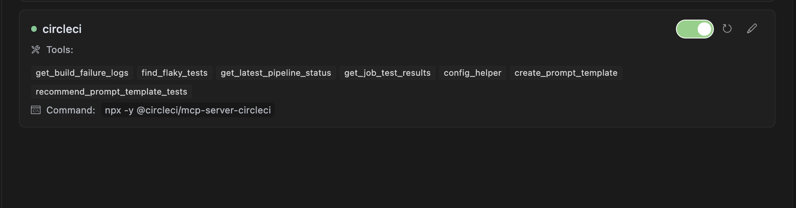
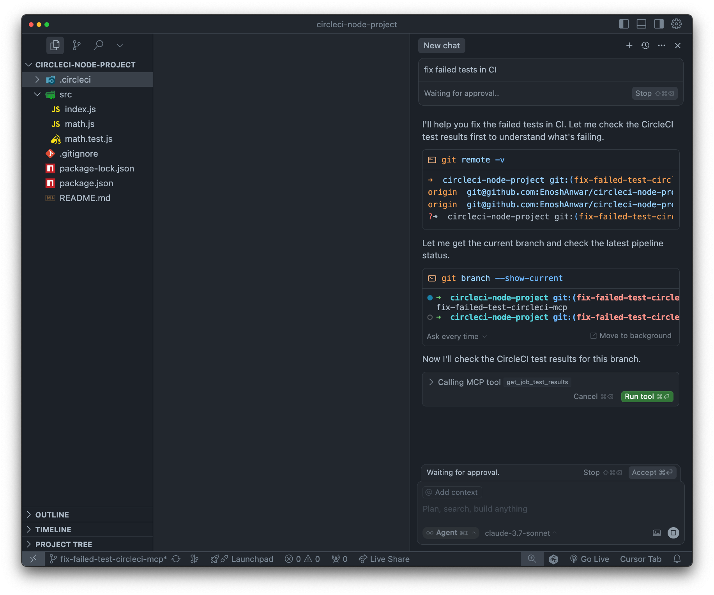
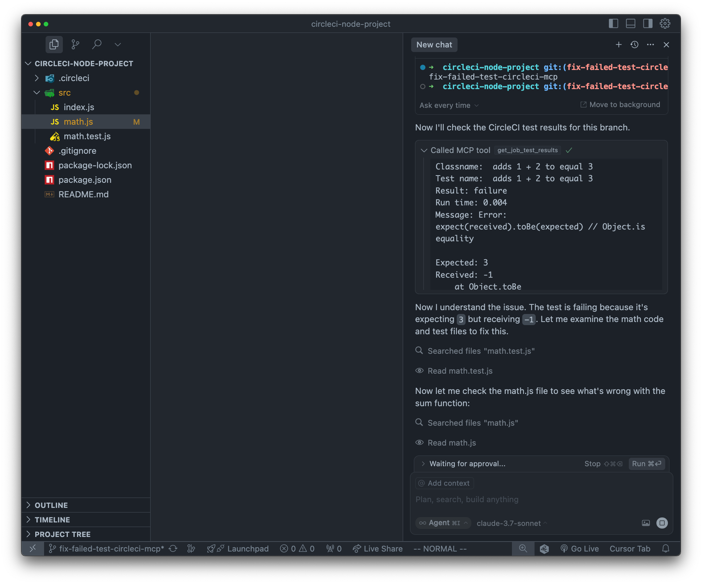
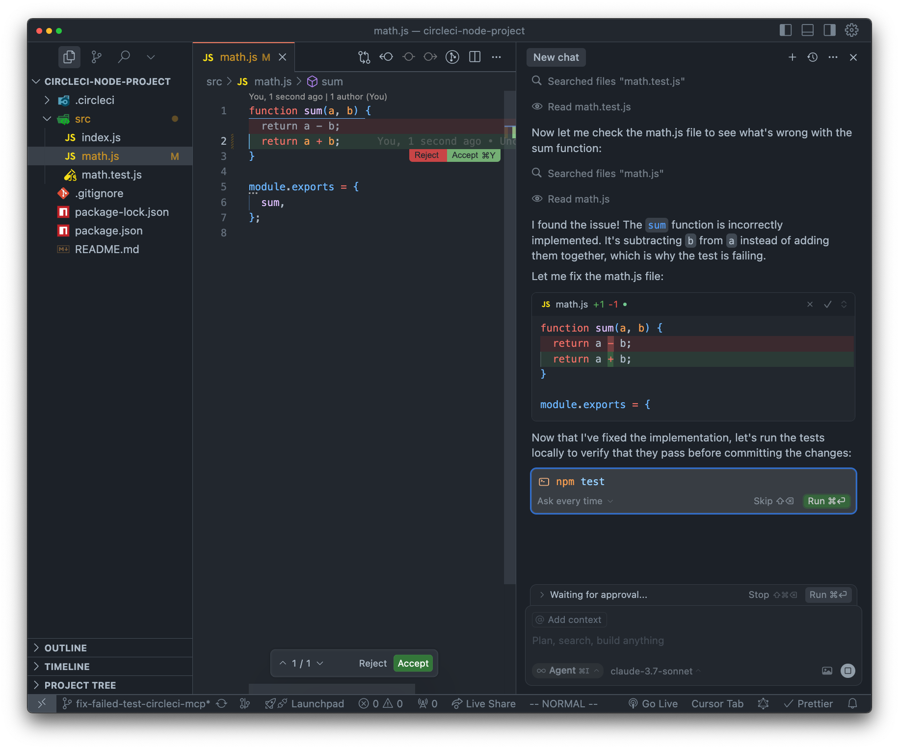
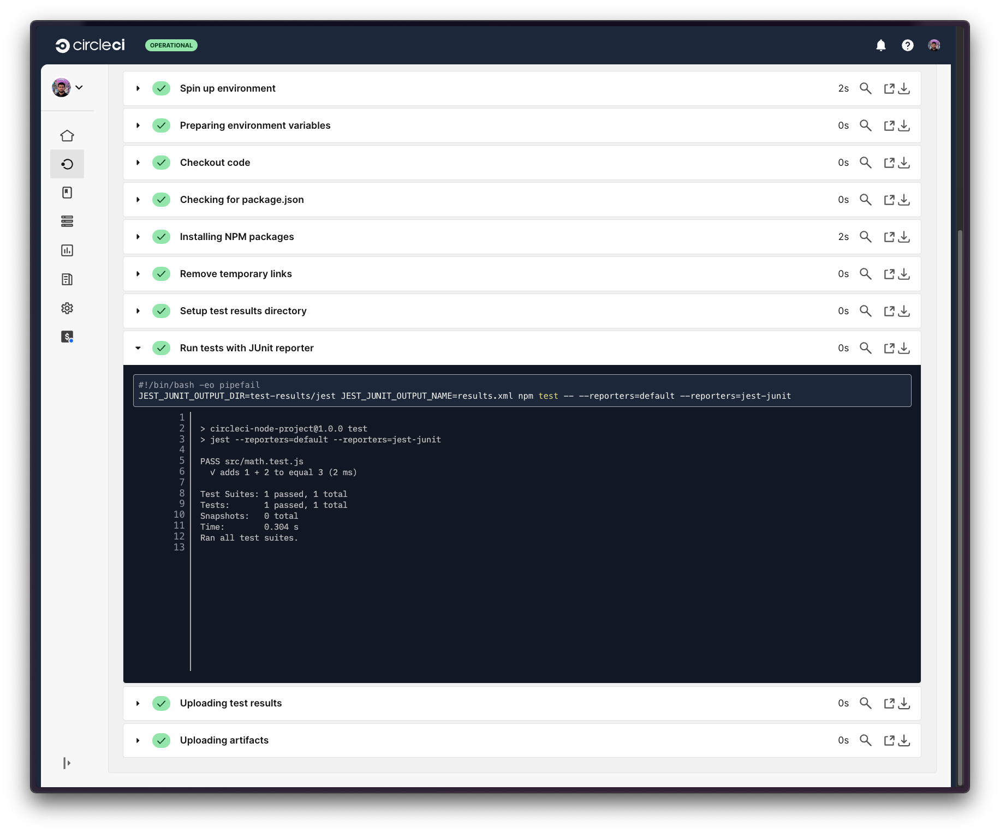

# Fix Failed Tests in CircleCI Build Example

This example demonstrates how to fix failed tests in CircleCI builds using the MCP Server API.

## Overview

The example shows how to:

- Retrieve test results and failure logs from a CircleCI build
- Analyze test failure details to identify the root cause
- Automatically fix code issues causing test failures

## Prerequisites

- [CircleCI account](https://circleci.com/signup/) with [Personal Access Token](https://circleci.com/docs/managing-api-tokens/)
- NodeJS 18+ installed

## Steps

1. Create a GitHub repository with contents of this directory
2. Create a CircleCI Organization and a project named `fix-failed-tests` and connect it to this GitHub repository.
3. Generate a CircleCI Personal Access Token.
4. Push the code to GitHub and trigger a CircleCI build. The build will fail because there's a deliberate error in the math function implementation.
5. Now you should see a test failure in the CircleCI pipeline.
   
6. Configure the CircleCI MCP Server in your IDE. View setup instructions [here](https://github.com/circleci-public/mcp-server-circleci/?tab=readme-ov-file#installation)
   
7. Go to the IDE and open chat in agent mode. Ask the agent to `fix failed tests in ci`.
   
8. The agent should make the tool call and retrieve the test failure details.
   
9. The agent will identify that the issue is in the math function implementation and fix it.
   
10. Now you can make a commit to the repository and push it to GitHub. This will trigger a new build in CircleCI. You should see the tests passing.
    
