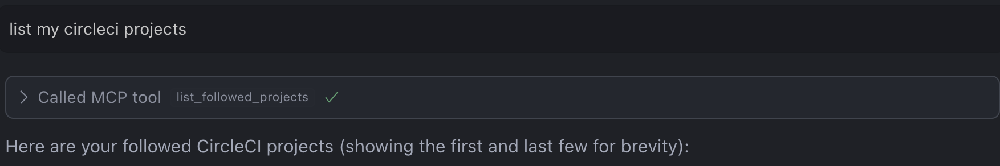
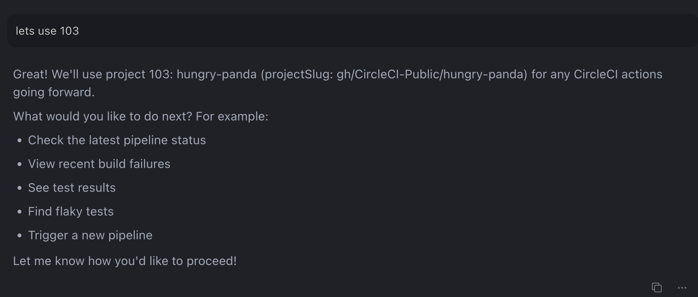
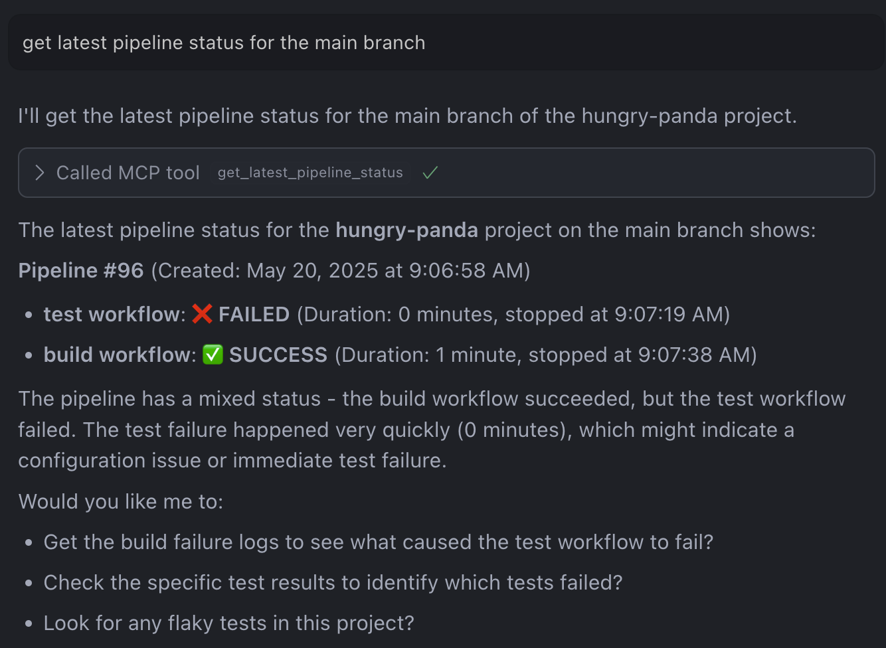

# Get Latest Pipeline Status Example

This example demonstrates how to retrieve the status of the latest pipeline for a CircleCI project using the MCP Server's `getLatestPipelineStatus` tool.

## Overview

This example shows how to:

- List all CircleCI projects you're following, then select one to work with
- Get the status of the latest pipeline for your selected project (on any branch)
- Use other tools (like finding failed builds) without needing to supply a URL

## Prerequisites

- [CircleCI account](https://circleci.com/signup/) with [Personal Access Token](https://circleci.com/docs/managing-api-tokens/)
- NodeJS 18+ installed

## Steps

1. Create a GitHub repository with the contents of this directory
2. Create a CircleCI Organization and a project named `get-latest-pipeline-status` and connect it to this GitHub repository.
3. Generate a CircleCI Personal Access Token.
4. Configure the CircleCI MCP Server in your IDE. View setup instructions [here](https://github.com/circleci-public/mcp-server-circleci/?tab=readme-ov-file#installation)
5. In your IDE, open chat in agent mode. Ask the agent to `list my CircleCI projects`.
6. Choose a project from the list that you want to work with. The agent will extract and remember the projectSlug:
   
   
7. Now you can ask the agent to get the latest pipeline status for a specific branch, e.g., "Get the status of the latest pipeline for the main branch". The agent will use the selected project and branch to retrieve the pipeline status:
   

## How it Works

The `getLatestPipelineStatus` tool can be used by selecting a project and branch, providing a CircleCI URL, or using your local project context.

This is particularly useful for:
- Getting the status of the latest pipeline for a specific branch
- Quickly checking the status of the latest pipeline without leaving your IDE
