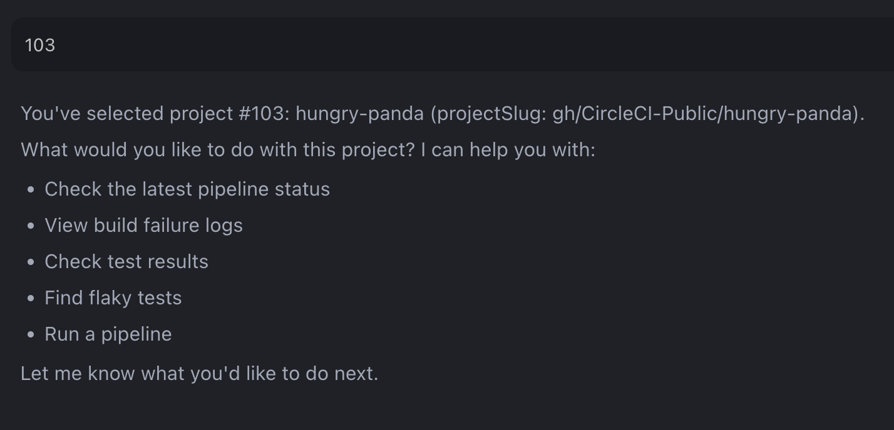

# List CircleCI Projects Example

This example demonstrates how to list and interact with your CircleCI projects using the MCP Server.

## Overview

The example shows how to:

- List all CircleCI projects you're following
- Select a specific project to work with
- Fetch build failures for your selected project

## Prerequisites

- [CircleCI account](https://circleci.com/signup/) with [Personal Access Token](https://circleci.com/docs/managing-api-tokens/)
- NodeJS 18+ installed

## Steps

1. Create a GitHub repository with contents of this directory
2. Create a CircleCI Organization and a project named `list-followed-projects` and connect it to this GitHub repository.
3. Generate a CircleCI Personal Access Token.
4. Configure the CircleCI MCP Server in your IDE. View setup instructions [here](https://github.com/circleci-public/mcp-server-circleci/?tab=readme-ov-file#installation)
5. Go to the IDE and open chat in agent mode. Ask the agent to `list my CircleCI projects`.
6. The agent will use the `listFollowedProjects` tool to display all projects you're following.
   
7. Choose a project from the list that you want to analyze. The agent will extract the projectSlug.
   
8. Now you can ask the agent to perform operations on your selected project, such as "get build failures for the main branch". The agent will automatically use the previously selected project's information without requiring you to provide URLs or additional project details.
   

## How it Works

The `listFollowedProjects` tool:
- Retrieves and displays all CircleCI projects you're following
- Provides each project's name and its corresponding projectSlug (e.g., `gh/organization/project-name`)

Once a project is selected, the project and projectSlug are stored in the conversation context. This allows you to use other CircleCI tools without specifying project details.
