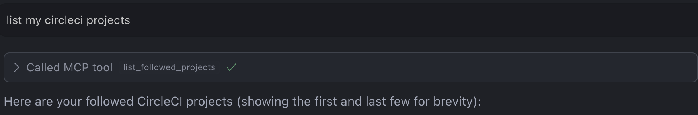
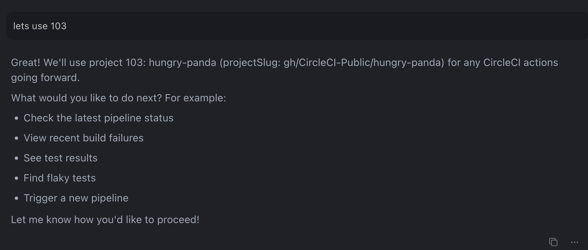
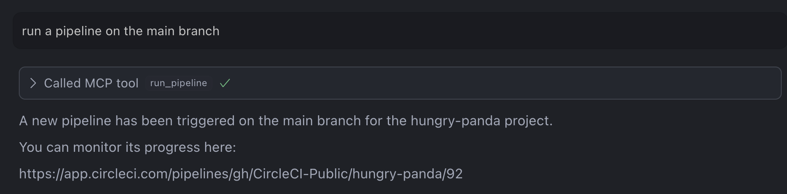
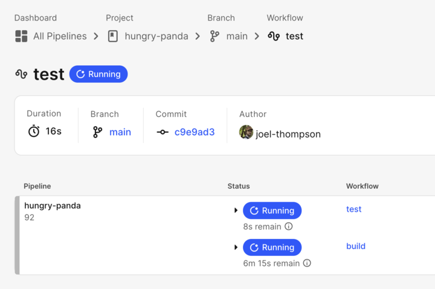

# Run CircleCI Pipeline Example

This example demonstrates how to trigger and monitor CircleCI pipelines using the MCP Server's `runPipeline` tool.

## Overview

This example shows how to:

- List all CircleCI projects you're following, then select one to work with
- Run a pipeline for your selected project (on any branch)
- Use other tools (like finding failed builds) without needing to supply a URL

## Prerequisites

- [CircleCI account](https://circleci.com/signup/) with [Personal Access Token](https://circleci.com/docs/managing-api-tokens/)
- NodeJS 18+ installed

## Steps

1. Create a GitHub repository with the contents of this directory
2. Create a CircleCI Organization and a project named `run-pipeline` and connect it to this GitHub repository.
3. Generate a CircleCI Personal Access Token.
4. Configure the CircleCI MCP Server in your IDE. View setup instructions [here](https://github.com/circleci-public/mcp-server-circleci/?tab=readme-ov-file#installation)
5. In your IDE, open chat in agent mode. Ask the agent to `list my CircleCI projects`.
6. Choose a project from the list that you want to work with. The agent will extract and remember the projectSlug:
   
   
7. Now you can ask the agent to run a pipeline for a specific branch, e.g., "Run a pipeline on the main branch". The agent will use the selected project and branch to trigger the pipeline. Once the tool call is done, it will return a link to monitor the pipeline execution:
   
8.  You can follow the link to monitor the pipeline:
   

## How it Works

The `runPipeline` tool can be used by selecting a project and branch, providing a CircleCI URL, or using your local project context. After triggering a pipeline, the tool returns a link so you can monitor its execution.

This is particularly useful for:

- Quickly running pipelines without visiting the CircleCI web UI
- Running pipelines from a specific branch
